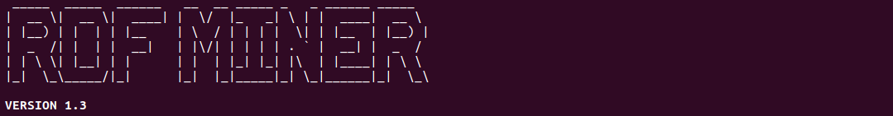

<!---->
     _____  _____  ______ __  __ _                 
    |  __ \|  __ \|  ____|  \/  (_)                
    | |__) | |  | | |__  | \  / |_ _ __   ___ _ __ 
    |  _  /| |  | |  __| | |\/| | | '_ \ / _ \ '__|
    | | \ \| |__| | |    | |  | | | | | |  __/ |   
    |_|  \_\_____/|_|    |_|  |_|_|_| |_|\___|_|   
                                                
**VERSION 1.4**                               

## Requirements

### For users 

- Docker for [Windows](https://docs.docker.com/docker-for-windows/install/), [Linux](https://docs.docker.com/engine/install/) or [Mac](https://docs.docker.com/docker-for-mac/install)
- [Docker Compose](https://docs.docker.com/compose/install) 

### For contributors

- Docker for [Windows](https://docs.docker.com/docker-for-windows/install/), [Linux](https://docs.docker.com/engine/install/) or [Mac](https://docs.docker.com/docker-for-mac/install)
- [Docker Compose](https://docs.docker.com/compose/install) 
- [Maven](https://maven.apache.org/download.cgi)
- [Java](https://www.java.com/fr/download/)

## How to install RDFMiner

1. Clone this repository
2. Execute the *install* shell file such as: ```cd install && ./install.sh```
> It will take some time !
3. Once the build phase is completed, we need to create and start all the services : ```sudo docker-compose up -d```

> You can check if it's correctly launched with the following command : ```sudo docker-compose ps```
```
        Name                      Command               State                Ports             
-----------------------------------------------------------------------------------------------
rdfmining_corese_1     /bin/sh -c $LAUNCH               Up      0.0.0.0:9100->9100/tcp,
                                                                :::9100->9100/tcp                      
rdfmining_rdfminer_1   ./rdfminer/scripts/run.sh  ...   Up                                     
rdfmining_virtuoso_1   /bin/bash /virtuoso/script ...   Up      1111/tcp, 8890/tcp, 
                                                                0.0.0.0:9000->9000/tcp,
                                                                :::9000->9000/tcp
```

## How to use RDFMiner

1. Put all the files you need (e.g. your .bnf grammar, axioms to assess in *.txt* file, ...) in the **/IO** folder.
2. Once this phase is complete, you can launch the *RDFMiner* container in order to launch the software : ```sudo docker-compose exec rdfminer ./rdfminer/scripts/run.sh [PARAMETERS]```

## Parameters

```
 -af (--axioms-file) AXIOM_FILE         : test axioms contained in this file
 -ckp (--Checkpoint) CHECK_POINT        : Checkpoint (default: 1)
 -cr (--type-crossover) TYPE_CROSSOVER  : use as this value as the type of
                                          parent selection operation (default:
                                          2)
 -cs (--classic-shacl) CLASSIC_SHACL    : use classic SHACL validation
                                          (default: false)
 -d (--dynamic-timeout) ANGULAR_COEFF   : use a dynamic time-out for axiom
                                          testing (default: 0.0)
 -dir (--directory) RESULTFOLDER        : path of output folder (default:
                                          results)
 -div (--diversity) DIVER_METHOD        : use as this value as the chose of
                                          diversity method (default: 1)
 -el (--elitism) ELITISM_SELECTION      : use as this value as the choose of
                                          elitism selection (default: 1)
 -g (--grammar) GRAMMAR                 : use this file as the axiom grammar
                                          (default: /rdfminer/code/resources/OWL
                                          2Axiom-test.bnf)
 -ge (--grammatical-evolution)          : activate the grammatical evolution
 GRAMMATICAL_EVOLUTION                    for the entities extraction (default:
                                          false)
 -init (--init-len) INITLEN_CHROMOSOME  : use as this value as the initial
                                          length of chromosome (default: 20)
 -kb (--K_Base) K_BASE                  : KBase (default: 5000)
 -l (--loop) LOOP_CORESE                : Launch SubClassOf assessment with
                                          loop operator from Corese (default:
                                          false)
 -mxc (--max-codon) MAX_CODON           : use as this value as the max value of
                                          codon (default: 2147483647)
 -mxw (--max-wrapp) MAX_WRAPP           : use as this value as the max number
                                          of wrapping (default: 1)
 -ns (--novelty-search) NOVELTY_SEARCH  : use Novelty Search approach (default:
                                          false)
 -p (--prefixes) PREFIXES               : use this file as the prefixes to be
                                          used in SPARQL queries
 -pc (--prob-cross) PROB_CROSSOVER      : use as this value as the probability
                                          of crossover operation (default: 0.8)
 -pm (--prob-mut) PROB_MUTATION         : use as this value as the probability
                                          of mutation operation (default: 0.01)
 -ps (--population-size)                : use as this value as the initial size
 POPULATION_SIZE                          of population (default: 200)
 -psh (--probabilistic-shacl)           : use classic SHACL validation
 CLASSIC_SHACL                            (default: false)
 -ra (--random-axiom)                   : use the random axiom generator
                                          (default: false)
 -rs (--random-shapes) SHAPES           : enable SHACL Shapes mining (default:
                                          false)
 -s (--subclassof-list) FILE            : test subClassOf axioms generated from
                                          the list of subclasses in the given
                                          file
 -sa (--single-axiom) AXIOM             : test a single axiom given
 -se (--type-select) TYPE_SELECTION     : use as this value as the type of
                                          parent selection operation (default:
                                          2)
 -seez (--size-elite) SIZE_ELITE        : use as this value as the size of
                                          elitism selection (default: 0.02)
 -sez (--size-select) SIZE_SELECTION    : use as this value as the size of
                                          parent selection operation (default:
                                          0.7)
 -sf (--shapes-file) SHAPES_FILE        : test shapes contained in this file
 -shacl-a (--shacl-alpha) SHACL_PROB_A  : set the value of alpha for SHACL
                                          probabilistic mode (Hypothesis
                                          testing) (default: 0.05)
 -shacl-p (--shacl-probability)         : set the value of p for SHACL
 SHACL_PROB_P                             probabilistic mode (default: 0.05)
 -t (--timeout) SECONDS                 : use this time-out (in seconds) for
                                          axiom testing (default: 0)
 -target (--target-endpoint) TARGET     : specify the SPARQL endpoint to be
                                          used for sending requests
 -tinit (--type-init) TYPE_INITIALIZATI : use as this value as the type of
 ON                                       initialization (default: 1)
 -train (--train-endpoint) TRAIN        : specify the SPARQL endpoint to be
                                          used as a training dataset
```
> **INFO**      The container takes the same parameters as RDFMiner jar file

## Datasets 

*RDFMiner* provides two distincts RDF graphs:

- A mirror of *DBPedia 2015.04* (english version), which is available from the following endpoint: http://134.59.130.136:8890/sparql

> **WARNING**   by default, RDFMiner uses this endpoint as default value of **-target** parameter when it's not provide by user.

- 1% of full instance of *DBPedia 2015.04* (english version), which is available from the following endpoint: http://172.19.0.2:9000/sparql

> **WARNING**   by default, RDFMiner uses the value of **-target** as default value of **-train** parameter when it's not provide by user. It's not optimal in the evolutionary discovery context because you will consider all the instances for each OWL Axioms or SHACL Shapes assessment (if the dataset of the **-target** value contains a very large set of triples).

## Use cases 

Here are some practical examples depending of the choosen context:

### OWL Axioms mining 

#### SubClassOf axioms 

> **INFO** BNF Grammar file of atomic SubClassOf axioms: *OWL2Axiom-subclassof.bnf*

> **INFO** BNF Grammar file of complex SubClassOf axioms: *OWL2Axiom-complex-subclassof.bnf*

> **EXAMPLE** docker-compose exec -T rdfminer ./rdfminer/scripts/run.sh -ge -ra -l -train "http://172.19.0.2:9000/sparql" -g /rdfminer/io/OWL2Axiom-complex-subclassof.bnf -dir test_complex_subclassof/ -ps 20 -kb 100 -cr 1 -pc 0.7 -pm 0.01 -div 1 -mxw 1 -se 2 -t 500

> **INFO** The **-l** provides a efficient way to assess SubClassOf axioms, based on SPARQL Queries optimisation.

#### DisjointClasses axioms 

> **INFO** BNF Grammar file of atomic DisjointClasses axioms: *OWL2Axiom-disjoint.bnf*

> **INFO** BNF Grammar file of complex DisjointClasses axioms: *OWL2Axiom-complex-disjoint.bnf*

> **EXAMPLE** docker-compose exec -T rdfminer ./rdfminer/scripts/run.sh -ge -ra -l -train "http://172.19.0.2:9000/sparql" -g /rdfminer/io/OWL2Axiom-complex-subclassof.bnf -dir test_complex_subclassof/ -ps 50 -kb 100 -cr 1 -pc 0.7 -pm 0.01 -div 1 -mxw 1 -se 2

### OWL Axioms evaluation

> **EXAMPLE** docker-compose exec -T rdfminer ./rdfminer/scripts/run.sh -a your_axioms.txt -dir test_eval_axioms/

> **INFO** The content of *your_axioms.txt* MUST contains well-formed OWL axioms like:
```
SubClassOf(<c1> <c2>) 
SubClassOf(<c3> <c1>)
...
SubClassOf(<cn> <ck>)
# <c1>; <c2>; <c3>; <cn> and <ck> are OWL Classes
```

### SHACL Shapes evaluation

#### Standard SHACL Validation

> **EXAMPLE** docker-compose exec -T rdfminer ./rdfminer/scripts/run.sh -cs -sf your_shapes.ttl -dir test_sh_eval/ 

> **INFO** The content of *your_shapes.ttl* MUST contains well-formed SHACL Shapes (e.g. using Turtle format) like:
```
# You must define prefixes used in this file
BASE             <http://rdfminer.com/shapes/>
PREFIX rdf:      <http://www.w3.org/1999/02/22-rdf-syntax-ns#>
PREFIX sh:       <http://www.w3.org/ns/shacl#> 

<2> a sh:NodeShape ;
    sh:targetClass <c1> ;
    sh:property [  
        sh:path rdf:type ;  
        sh:hasValue <c2>;
    ] .  
```

#### Probabilistic SHACL Validation

> **EXAMPLE** docker-compose exec -T rdfminer ./rdfminer/scripts/run.sh -psh -shacl-p 0.5 -sf your_shapes.ttl -dir test_psh_eval/

## Documentations

All resources about the project are avalaible on [docs](https://github.com/RemiFELIN/RDFMining/tree/main/RDFMiner/docs) folder. The [working-paper.pdf](https://github.com/RemiFELIN/RDFMining/blob/main/RDFMiner/docs/working-paper.pdf) gives an overview of RDFMiner project (context, aim, ...). Others documents are related to our publications. 
